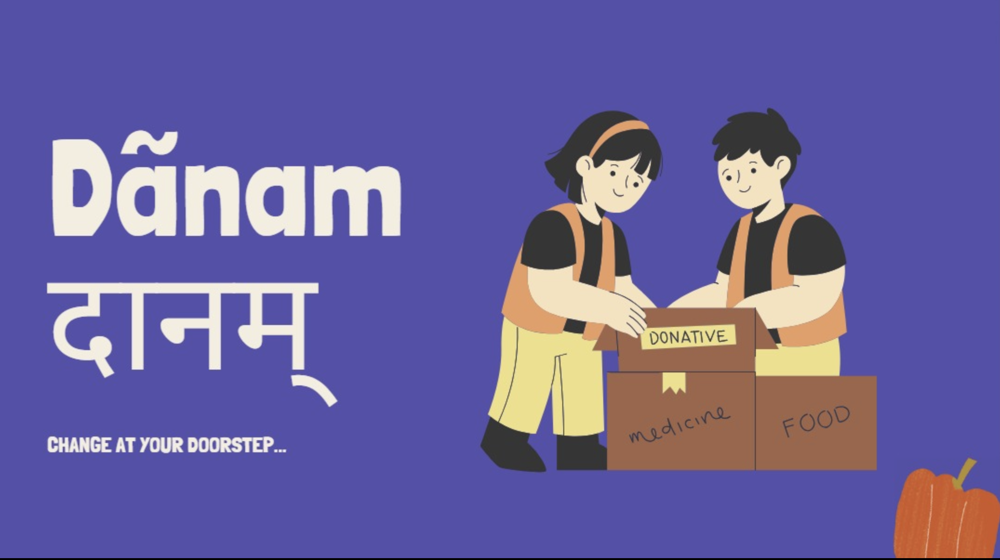

# Danam Donation App

# TODO List for Donation Portal

## 1. Dashboards

Create three distinct dashboards with tailored features for:

- [x] **User**
- [ ] **NGO**
- [ ] **Volunteer**

### NGO Dashboard

- [ ] Display user donation requests along with their location on a map.
- [ ] Show the status of each request with an option to update it.
- [ ] Track live location of the assigned volunteer for each accepted user request.
- [ ] When a request is accepted:
  - [ ] Assign a volunteer to the user.
  - [ ] Enable volunteer to view the user's location.
  - [ ] Enable user to view the volunteer’s live location.
- [ ] Show total number of donations made and a breakdown of items donated (e.g., Clothes: 100,
      Books: 200).

### Volunteer Dashboard

- [ ] Display volunteer status, which can be toggled between **online** and **offline**.
  - [ ] Only **online** volunteers appear on the NGO dashboard to be assigned to user requests.
- [ ] Volunteers should be able to view:
  - [ ] The location of the user when assigned.
  - [ ] Personal details of the user, as provided by the user in their profile.

### User Dashboard

- [ ] **Profile Creation**: Prompt users to provide personal information and create a profile.
- [ ] **Donation Selection**:
  - [ ] Show available items that the user can donate, with an option to specify quantity.
- [ ] **Request Process**:
  - Once a pickup request is placed:
    - Nearby NGOs will see the user’s info and items listed for donation.
    - NGOs can either **accept** or **decline** the request based on volunteer availability.
    - If accepted, a volunteer will be assigned to the request, allowing the user to track the
      volunteer’s live location.

## 2. Authentication

- [ ] Create login and signup pages for each type of user (User, NGO, Volunteer).
- [ ]Collect personal information for user profiles, with certificate verification for NGOs.

## 3. Dashboard Visuals

- [ ]Add images of NGOs or people engaged in donation activities to each dashboard.

## 4. Dashboard Branding

- [ ] Change the name "Danam" to its Hindi equivalent on all dashboards.

## 5. Language Support (Optional)

- [ ] Integrate a language translator feature to allow users to select their preferred language.

